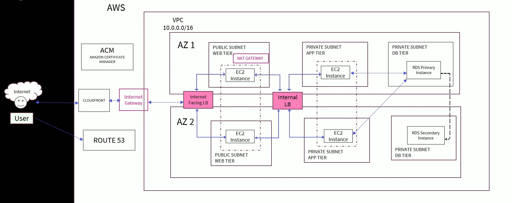

# 🛒 Evershop Deployment on AWS – Cloud Project

### 🚀 Overview
This repository documents the complete cloud deployment lifecycle of the **Evershop e-commerce platform**, implemented as part of my **Nullclass Cloud Internship**.  
The goal was to architect, deploy, and scale a production-like web application using **AWS services**, ensuring reliability, scalability, and cost efficiency — all within the AWS Free Tier.

---

### 🧩 Project Objectives
- Design and deploy a **multi-tier e-commerce application** architecture.
- Implement **database hosting, application deployment, storage integration, scaling, and content delivery** using AWS cloud services.
- Configure **domain management and SSL** for secure, production-ready access.
- Optimize performance with **CloudFront caching** and **Auto Scaling**.

---

### ☁️ AWS Architecture Summary
The final architecture consists of:

- **VPC** with public and private subnets for isolation.  
- **RDS (MySQL)** for reliable, managed database hosting.  
- **EC2 (App Tier)** for running the Evershop Node.js-based web application.  
- **S3** for storing and serving static product images.  
- **Application Load Balancer (ALB)** for distributing traffic evenly.  
- **Auto Scaling Group (ASG)** for high availability and elasticity.  
- **Route 53** for custom domain management (`evershopintern.com`).  
- **AWS Certificate Manager (ACM)** for HTTPS/SSL encryption.  
- **CloudFront** CDN for faster global content delivery.

---

### 🧱 Implementation Flow

1. **Database Layer:**  
   Set up a private **RDS MySQL** instance within the VPC, secured to allow inbound connections only from the application tier EC2 instance.

2. **Application Layer:**  
   Deployed the **Evershop** platform on EC2 using Docker containers (Node.js app + PostgreSQL). Configured the app for database connectivity and accessibility through the instance’s public IP.

3. **Storage Layer:**  
   Migrated product images to an **S3 bucket** and reconfigured the app’s product table to fetch image URLs from S3.

4. **Scalability & Reliability:**  
   Implemented an **Auto Scaling Group** using a **Launch Template** and connected it to an **Application Load Balancer** for high availability.

5. **Secure Custom Access:**  
   Registered and configured a custom domain `evershopintern.com` in **Route 53**, issued an **SSL certificate via ACM**, and enforced **HTTPS redirection** through the ALB.

6. **Performance Optimization:**  
   Integrated **CloudFront** with the S3 bucket, enabled **Origin Access Control (OAC)** for security, and tested caching and latency improvements globally.

---

### 🧠 Key Learnings
- End-to-end understanding of **AWS cloud architecture design** and service integration.  
- Hands-on experience with **networking, IAM, security groups, and scaling policies**.  
- Best practices for **deploying production-ready applications** with resilience and performance optimization.  
- Skills in **cost-effective cloud resource management** using AWS Free Tier.

---

### 🛠️ Tech Stack
| Layer | Service / Tool | Purpose |
|-------|----------------|----------|
| Database | Amazon RDS (MySQL) | Managed relational database |
| Backend | Node.js (Docker on EC2) | Evershop application hosting |
| Storage | Amazon S3 | Product image storage |
| Networking | VPC, Subnets, Security Groups | Secure network configuration |
| Load Balancing | Application Load Balancer | Traffic distribution |
| Scaling | Auto Scaling Group | Dynamic instance scaling |
| Domain | Route 53 | Custom domain management |
| Security | ACM | SSL certificate management |
| CDN | CloudFront | Global content delivery & caching |

---

### 🏗️ Architecture Diagram

---

### 🏁 Outcome
The deployment successfully transformed a standalone e-commerce app into a **scalable, secure, and globally optimized cloud application**.  
Each AWS service was configured with security and efficiency in mind, aligning with real-world cloud deployment standards.

---

### 📚 Acknowledgement
This project was completed as part of the **Nullclass Cloud Internship Program**, providing valuable exposure to **real AWS infrastructure design and DevOps practices**.

---

### 👩‍💻 Author
**Hemalatha M**  
2nd Year B.Tech – Information Technology  
Rajalakshmi Engineering College  
GitHub: [https://github.com/hemalatha-0307/evershop-deployment]
LinkedIn: [www.linkedin.com/in/hemalatha-m07]

